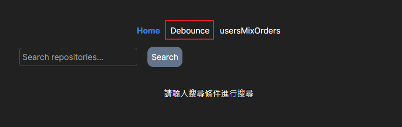
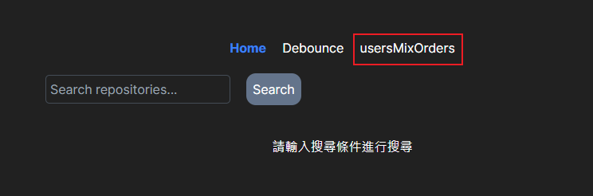
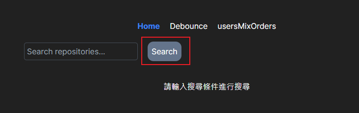

"# nexrepotechdata"

### node 版本 20.11.1

---

#### debounce  頁面位置: /debounce_page  功能位置: utils/debounce.js

#### 合併users 和 orders  頁面位置: /usersMixOrders_page  功能位置: utils/usersMixOrders.js

#### Github repository 搜尋功能 再輸入框輸入後按search 搜尋

#### Class 模擬 Set  位置 : app/plusQ/JsSet.js

#### Class 模擬 Queue 位置:  app/plusQ/JsQueue.js

#### Class 模擬 Singly Linked ListClass  位置: app/plusQ/SinglyLinkedListJsQueue.js
